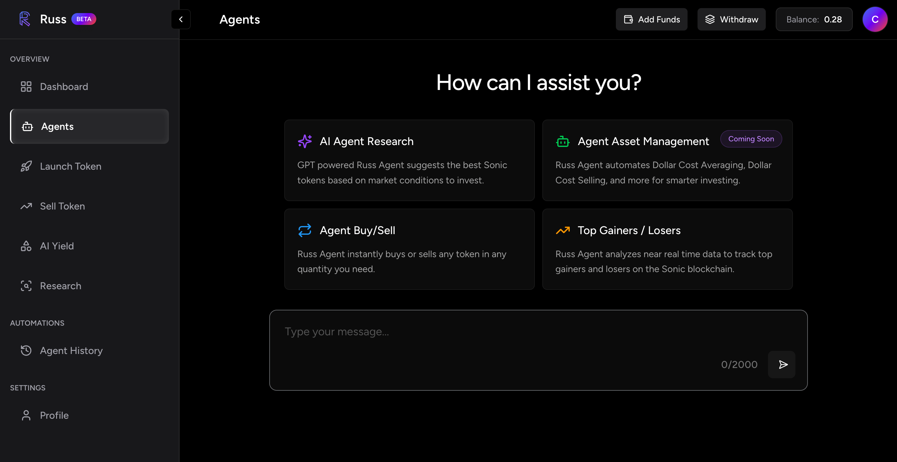

# RussFi DeFAI Portfolio Manager Agent On Sonic

RussFi is an DeFi portfolio management agent designed for the Sonic blockchain. It leverages Zerepy for seamless token swap functionality and integrates smart AI features to help manage your decentralized finance portfolio.

## Tech Stack

- **Backend:** PHP
- **Frontend:** React
- **Swap Integration:** Zerepy Modified for Privy
- **Blockchain:** Sonic

## Features

- **DeFAI Agent:** Intelligent, AI-powered portfolio management and trading.
- **Swap Functionality:** Secure and efficient token swaps using Zerepy.
- **Sonic Blockchain Integration:** Robust and scalable interactions on the Sonic blockchain.
- **Open Source:** Community-driven development under the MIT license.

## License

This project is open-sourced software licensed under the MIT license.

## Contact

For questions or support, please contact [support@russfi.com](mailto:support@russfi.com). # russfi
